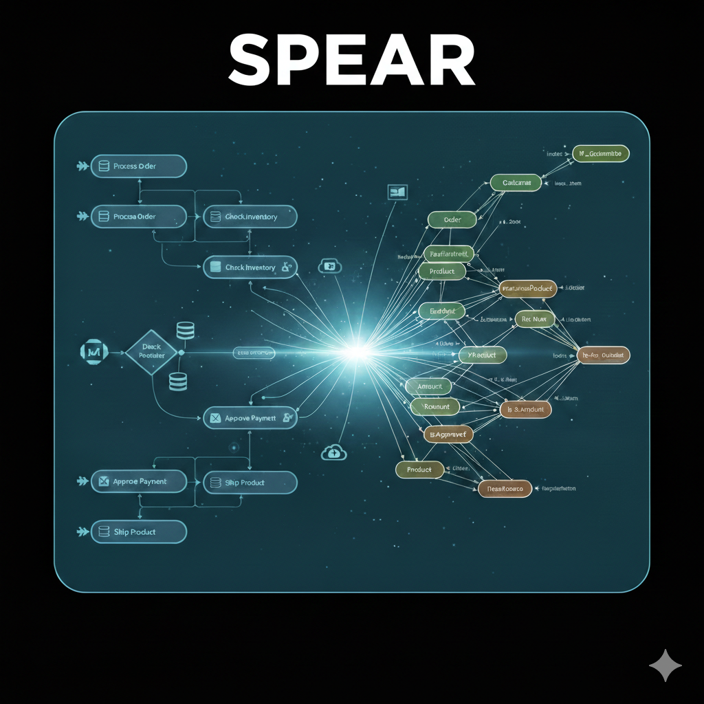

## SPEAR: Semantic Process Engine as RDF



### 1. Overview

The **Semantic Process Engine** is a lightweight, Python-based BPMN orchestrator that uses **RDF (Resource Description Framework)** and **SPARQL** as its core execution language. Unlike traditional engines that store state in relational tables, this engine treats business processes as a living Knowledge Graph.

### 2. Why Semantic? (The Value Proposition)

* **Schema-less Flexibility:** Add new process variables or metadata on the fly without database migrations.
* **Logical Reasoning:** Use SPARQL `ASK` queries to make complex routing decisions based on the entire knowledge base, not just local variables.
* **Native Audit Trail:** Every process step is an immutable event in the graph, making the engine "Audit-Ready" by design.
* **Interoperability:** Your process data is stored in W3C standard formats, making it instantly readable by AI, BI tools, and other RDF-compatible systems.

---

### 3. High-Level Architecture

The engine follows a decoupled, asynchronous pattern:

* **Data Layer:** In-memory RDF graphs (rdflib) storing Process Definitions and Runtime State.
* **Orchestration:** A Python core using `rdflib` to move "Tokens" through the graph.
* **Execution:** Background workers that trigger Python functions based on `bpmn:topic`.
* **Interface:** A FastAPI REST API for managing processes, instances, and topic handlers.

---

### 4. Supported BPMN Elements

SPEAR supports a broad set of BPMN 2.0 elements.

Support labels in this section refer to **runtime execution support** in the
current engine (`StorageFacade` path), not just BPMN parsing/import capability.

Legend:
- `✅ Full`: parsed and executable end-to-end
- `⚠️ Partial`: parsed, but runtime behavior is limited or simplified
- `🧪 Basic`: executable with minimal/default behavior

#### 4.1 Events

| Element | Support | Description |
|---------|---------|-------------|
| **StartEvent** | ✅ Full | Process initiation point, supports multiple start events |
| **EndEvent** | ✅ Full | Process termination, supports message end events |
| **Intermediate Throw Event** | ⚠️ Partial | Message throw supported; non-message throw types are limited |
| **Intermediate Catch Event** | ⚠️ Partial | Message/timer catch supported; advanced event semantics are limited |
| **Boundary Events** | ✅ Full | Attached to activities, supports message/timer/error/signal |

##### 4.1.1 Error End Events

| Element | Support | Description |
|---------|---------|-------------|
| **Error End Event** | ✅ Full | Throws an error and terminates the instance |
| **Cancel End Event** | ✅ Full | Terminates transaction subprocess and instance |
| **Compensation End Event** | ✅ Full | Triggers compensation handler for rollback |
| **Terminate End Event** | ✅ Full | Immediately terminates all tokens and instance |

**Error End Event Example:**
```xml
<serviceTask id="ValidateOrder" camunda:topic="validate_order"/>
<endEvent id="ErrorEnd">
  <errorEventDefinition errorRef="Error_ValidationFailed"/>
</endEvent>
<sequenceFlow sourceRef="ValidateOrder" targetRef="ErrorEnd"/>
```

**Cancel End Event (in Transaction Subprocess):**
```xml
<subProcess id="PaymentTransaction" triggeredByEvent="false">
  <startEvent id="TxStart"/>
  <serviceTask id="ProcessPayment" camunda:topic="process_payment"/>
  <cancelEndEvent id="CancelPayment"/>
  <sequenceFlow sourceRef="TxStart" targetRef="ProcessPayment"/>
  <sequenceFlow sourceRef="ProcessPayment" targetRef="CancelPayment"/>
</subProcess>
```

**Compensation End Event:**
```xml
<serviceTask id="CreateOrder" camunda:topic="create_order"/>
<compensationEndEvent id="CompensateOrder">
  <compensationEventDefinition compensateRef="UndoOrder"/>
</compensationEndEvent>
<sequenceFlow sourceRef="CreateOrder" targetRef="CompensateOrder"/>
```

##### 4.1.2 Error Boundary Events

| Element | Support | Description |
|---------|---------|-------------|
| **Error Boundary Event** | ✅ Full | Interrupts or continues activity on error |
| **Compensation Boundary Event** | ✅ Full | Triggers compensation when activity completes |

**Error Boundary Event Example:**
```xml
<serviceTask id="ProcessPayment" camunda:topic="process_payment">
  <boundaryEvent id="ErrorBoundary" attachedToRef="ProcessPayment" cancelActivity="true">
    <errorEventDefinition errorRef="Error_PaymentFailed"/>
  </boundaryEvent>
</serviceTask>
<serviceTask id="HandleError" camunda:topic="handle_payment_error"/>
<endEvent id="ErrorEnd"/>
<sequenceFlow sourceRef="ProcessPayment" targetRef="ErrorEnd"/>
<sequenceFlow sourceRef="ErrorBoundary" targetRef="HandleError"/>
<sequenceFlow sourceRef="HandleError" targetRef="ErrorEnd"/>
```

**Compensation Boundary Event Example:**
```xml
<serviceTask id="BookHotel" camunda:topic="book_hotel">
  <boundaryEvent id="CompBoundary" attachedToRef="BookHotel" cancelActivity="false">
    <compensationEventDefinition compensateRef="CancelHotelBooking"/>
  </boundaryEvent>
</serviceTask>
<serviceTask id="CancelHotel" camunda:topic="cancel_hotel_booking"/>
<sequenceFlow sourceRef="CompBoundary" targetRef="CancelHotel"/>
```

#### 4.2 Activities

| Element | Support | Description |
|---------|---------|-------------|
| **Service Task** | ✅ Full | Execute registered topic handlers |
| **User Task** | ✅ Full | Manual tasks requiring human intervention |
| **Send Task** | 🧪 Basic | Emits configured message and continues flow |
| **Receive Task** | ✅ Full | Message waiting and receiving |
| **Script Task** | ✅ Full | Python script execution (secure by default) |
| **Manual Task** | 🧪 Basic | Recorded pass-through task with audit event |

##### 4.2.1 Script Tasks

SPEAR supports Script Tasks for executing Python code within process flows. Script tasks can read and modify process variables using simple Python expressions.

**Security:** Script task execution is **disabled by default** for security. It must be explicitly enabled before execution.

```xml
<scriptTask id="CalculateTotal" name="Calculate Order Total" 
           scriptFormat="python">
  <script>
total = quantity * price
tax = total * 0.10
grand_total = total + tax
  </script>
</scriptTask>
```

**Configuration:**
```python
from src.api.storage import RDFStorageService

storage = RDFStorageService()

# Enable script task execution (not recommended for production)
storage.script_tasks_enabled = True  # SECURITY: Only enable in trusted environments
```

**Script Variables:**

| Variable | Description |
|----------|-------------|
| `variables` | Dictionary of all process instance variables |
| Direct access | Variables are accessible as `variableName` in script |
| Assignments | Variables can be set by assignment: `total = quantity * price` |

**Example with Variables:**

```xml
<scriptTask id="CalculateTax" scriptFormat="python">
  <script>
subtotal = items_total
tax = subtotal * 0.08
total = subtotal + tax
  </script>
</scriptTask>
```

**Execution Behavior:**

| Setting | Behavior |
|---------|----------|
| Disabled (default) | Logs warning and skips to next node |
| Enabled | Executes script, updates variables, moves to next node |
| Script error | Instance status set to ERROR |

**Security Considerations:**

- Script execution uses Python's `exec()` with restricted globals
- Only `print` and `datetime` are available as built-ins
- Scripts run in the same process as the engine
- Production use: Enable only in trusted environments
- Alternative: Use Service Tasks with registered topic handlers for production workflows

##### 4.2.2 Camunda Listeners

SPEAR supports Camunda-style listeners for executing custom logic at specific points in the process and task lifecycle. Listeners reference registered topic handlers, avoiding inline script execution.

**Supported Listener Types:**

| Listener Type | Events | Description |
|--------------|--------|-------------|
| **Execution Listener** | `start`, `end`, `take` | Execute when an activity starts, ends, or a flow is taken |
| **Task Listener** | `create`, `assignment`, `complete` | Execute when a user task is created, assigned, or completed |

**BPMN Example:**

```xml
<serviceTask id="ProcessOrder" camunda:topic="process_order">
  <extensionElements>
    <!-- Execute when activity starts -->
    <camunda:executionListener event="start" expression="log_order_start" />
    
    <!-- Execute when activity ends -->
    <camunda:executionListener event="end" expression="log_order_complete" />
  </extensionElements>
</serviceTask>

<userTask id="ReviewTask" name="Review Order">
  <extensionElements>
    <!-- Execute when task is created -->
    <camunda:taskListener event="create" expression="notify_reviewer" />
    
    <!-- Execute when task is assigned -->
    <camunda:taskListener event="assignment" expression="send_assignment_email" />
    
    <!-- Execute when task is completed -->
    <camunda:taskListener event="complete" expression="validate_approval" />
  </extensionElements>
</userTask>
```

**Listener Attributes:**

| Attribute | Description | Use Case |
|-----------|-------------|----------|
| `expression` | Topic name referencing a registered handler | SPEAR-native topic handlers |
| `class` | Java class name for Camunda compatibility | External Java listeners |
| `delegateExpression` | Spring bean expression | Dependency injection integration |
| `event` | Event type (required) | When to trigger the listener |

**BPMN Example with All Attributes:**

```xml
<serviceTask id="ProcessOrder" camunda:topic="process_order">
  <extensionElements>
    <!-- SPEAR-native: Topic expression -->
    <camunda:executionListener event="start" expression="log_order_start" />
    
    <!-- Java class: For Camunda compatibility -->
    <camunda:executionListener event="end" class="com.example.OrderListener" />
    
    <!-- Delegate expression: Spring bean reference -->
    <camunda:executionListener event="take" delegateExpression="${orderFlowDelegate}" />
  </extensionElements>
</serviceTask>
```

**RDF Storage:**

Listeners are stored in RDF with full attribute preservation:

```turtle
@prefix bpmn: <http://dkm.fbk.eu/index.php/BPMN2_Ontology#> .

<http://example.org/bpmn/executionListener_1234>
    rdf:type <http://example.org/bpmn/ExecutionListener> ;
    bpmn:listenerElement <http://example.org/bpmn/ProcessOrder> ;
    bpmn:listenerEvent "start" ;
    bpmn:listenerExpression "log_order_start" ;
    bpmn:listenerClass "com.example.OrderListener" ;
    bpmn:listenerDelegateExpression "${orderFlowDelegate}" .
```

**Roundtrip Support:**

All listener attributes are preserved during BPMN import/export:
- `expression` - Preserved ✓
- `class` - Preserved ✓
- `delegateExpression` - Preserved ✓
- `event` - Preserved ✓

**Execution Behavior:**

| Event | Trigger Point |
|-------|---------------|
| `executionListener: start` | Before service task executes |
| `executionListener: end` | After service task completes |
| `executionListener: take` | When sequence flow is taken |
| `taskListener: create` | When user task is created |
| `taskListener: assignment` | When user is assigned to task |
| `taskListener: complete` | When user task is completed |

**Security Benefits:**

- **No inline scripts** - Listeners reference registered topic handlers only
- **Explicit registration** - Handlers must be explicitly added to `topic_handlers`
- **Reuses topic infrastructure** - Same security model as service tasks
- **Audit trail** - All listener executions logged as `LISTENER_EXECUTED`

**Comparison: Listeners vs Script Tasks**

| Feature | Listeners | Script Tasks |
|---------|-----------|--------------|
| Code location | Registered handlers | BPMN XML |
| Security | Safe (explicit registration) | Requires opt-in execution |
| Reusability | Topic registry | Copy-paste |
| Production use | Recommended | Use with caution |

#### 4.3 Gateways

| Element | Support | Description |
|---------|---------|-------------|
| **Exclusive Gateway** | ✅ Full | Single outgoing flow based on conditions |
| **Parallel Gateway** | ✅ Full | All outgoing flows activated simultaneously |
| **Inclusive Gateway** | ✅ Full | Multiple flows based on evaluated conditions |
| **Event-Based Gateway** | ⚠️ Partial | Waits for receive/message paths; advanced timer/event races are limited |

#### 4.4 Subprocesses

| Element | Support | Description |
|---------|---------|-------------|
| **Embedded Subprocess** | ✅ Full | Nested process definitions within parent |
| **Event Subprocess** | ⚠️ Partial | Message/timer start triggering supported; advanced BPMN variants limited |
| **Call Activity** | ⚠️ Partial | Inline called-scope execution with basic in/out mapping |

#### 4.5 Multi-Instance

| Element | Support | Description |
|---------|---------|-------------|
| **Parallel MI** | ✅ Full | Concurrent execution of multiple instances |
| **Sequential MI** | ✅ Full | Sequential iteration with loop cardinality |
| **MI Completion Condition** | ✅ Full | Continue until condition is met |

---

### 5. REST API Reference

SPEAR provides a comprehensive REST API built with FastAPI. All endpoints are documented at `/docs`.

#### 5.1 Process Definitions

```http
# List all processes
GET /api/v1/processes?status=active&page=1&page_size=20

# Get specific process
GET /api/v1/processes/{process_id}

# Deploy new process
POST /api/v1/processes
Content-Type: application/json
{
  "name": "Order Process",
  "description": "Order fulfillment workflow",
  "version": "1.0.0",
  "bpmn_file": "<?xml version=\"1.0\"...>"
}

# Update process
PUT /api/v1/processes/{process_id}

# Get RDF representation
GET /api/v1/processes/{process_id}/rdf

# Get process statistics
GET /api/v1/processes/{process_id}/statistics

# Delete process
DELETE /api/v1/processes/{process_id}
```

#### 5.2 Process Instances

```http
# List instances
GET /api/v1/instances?process_id={id}&status=RUNNING&page=1

# Get instance details
GET /api/v1/instances/{instance_id}

# Start new instance
POST /api/v1/instances
{
  "process_id": "order-process-id",
  "variables": {"orderId": "12345", "amount": 150.00},
  "start_event_id": null
}

# Stop instance
POST /api/v1/instances/{instance_id}/stop
{"reason": "Customer cancellation"}
```

#### 5.3 Variables

```http
# Get instance variables
GET /api/v1/instances/{instance_id}/variables

# Set variable
POST /api/v1/instances/{instance_id}/variables
{"name": "status", "value": "approved", "datatype": "string"}

# Get specific variable
GET /api/v1/instances/{instance_id}/variables/{name}
```

#### 5.4 Topic Handlers

```http
# List all handlers
GET /api/v1/topics

# Register HTTP handler
POST /api/v1/topics
{
  "topic": "send_notification",
  "handler_type": "http",
  "description": "Send push notification",
  "http_config": {
    "url": "https://api.example.com/notify/${userId}",
    "method": "POST",
    "headers": {"Authorization": "Bearer ${token}"},
    "response_extract": {
      "messageId": "$.id",
      "status": "$.status"
    }
  },
  "async_execution": false
}

# Register custom function handler
POST /api/v1/topics
{
  "topic": "calculate_tax",
  "handler_type": "function",
  "description": "Calculate order tax"
}

# Test handler
POST /api/v1/topics/{topic}/test
{"variables": {"amount": 100}}

# Update handler
PUT /api/v1/topics/{topic}

# Unregister handler
DELETE /api/v1/topics/{topic}
```

#### 5.5 Tasks

```http
# List user tasks
GET /api/v1/tasks?process_id={id}&assignee={user}

# Claim task
POST /api/v1/tasks/{task_id}/claim
{"assignee": "user@example.com"}

# Complete task
POST /api/v1/tasks/{task_id}/complete
{"variables": {"approval": true}}
```

#### 5.6 System Endpoints

```http
# Health check
GET /health

# API info
GET /info

# System statistics
GET /statistics

# Export all processes as RDF
GET /export/processes
```

#### 5.7 BPMN Layout Export

SPEAR supports preserving visual layout information from BPMN files using the BPMN Diagram Interchange (DI) standard.

```http
# Export BPMN without layout (default)
GET /api/v1/processes/{process_id}/bpmn

# Export BPMN WITH visual layout information
GET /api/v1/processes/{process_id}/bpmn?include_diagram=true
```

**Python API:**
```python
from src.conversion import RDFToBPMNConverter
from src.api.storage import RDFStorageService

storage = RDFStorageService()
converter = RDFToBPMNConverter()

# Export without layout (default)
bpmn_xml = converter.convert("process-id", storage)

# Export with layout preserved
bpmn_xml = converter.convert("process-id", storage, include_diagram=True)
```

**What Gets Preserved:**

| Element | Properties |
|---------|------------|
| **BPMNShape** | Position (x, y), Size (width, height) for all elements |
| **BPMNEdge** | Waypoints (x, y coordinates) for all sequence flows |

**Example Output with Layout:**
```xml
<bpmndi:BPMNDiagram>
  <bpmndi:BPMNPlane bpmnElement="OrderProcess">
    <bpmndi:BPMNShape id="StartEvent_1_di" bpmnElement="StartEvent_1">
      <dc:Bounds x="179" y="99" width="36" height="36" />
    </bpmndi:BPMNShape>
    <bpmndi:BPMNShape id="Task_1_di" bpmnElement="Task_1">
      <dc:Bounds x="250" y="80" width="100" height="80" />
    </bpmndi:BPMNShape>
    <bpmndi:BPMNEdge id="Flow_1_di" bpmnElement="Flow_1">
      <di:waypoint x="215" y="117" />
      <di:waypoint x="270" y="117" />
    </bpmndi:BPMNEdge>
  </bpmndi:BPMNPlane>
</bpmndi:BPMNDiagram>
```

**Note:** Layout information is extracted when BPMN files are deployed and stored as RDF triples. When exporting with `include_diagram=true`, the layout is reconstructed using the BPMN DI namespace standards.

#### 5.8 Error Handling

SPEAR provides comprehensive error handling through error events and API-based error injection.

```http
# Throw an error in a running instance
POST /api/v1/errors/throw
{
  "instance_id": "instance-uuid",
  "error_code": "Error_ValidationFailed",
  "error_message": "Order validation failed: missing customer ID"
}

# Response
{
  "instance_id": "instance-uuid",
  "error_code": "Error_ValidationFailed",
  "status": "caught",
  "caught_by_boundary_event": true
}

# Cancel a running instance
POST /api/v1/errors/cancel?instance_id=instance-uuid&reason=Customer%20request

# Get error-related variables for an instance
GET /api/v1/errors/{instance_id}/error-variables

# Response
{
  "instance_id": "instance-uuid",
  "error_variables": {
    "errorCode": "Error_PaymentFailed",
    "lastErrorCode": "Error_ValidationFailed",
    "lastErrorMessage": "Payment gateway timeout"
  },
  "instance_status": "ERROR"
}
```

**Error Handling Flow:**

1. **Error End Event**: When reached, sets instance status to `ERROR` and stores error code in variables
2. **Cancel End Event**: Terminates transaction subprocess and sets instance status to `CANCELLED`
3. **Terminate End Event**: Immediately terminates all tokens and sets instance status to `TERMINATED`
4. **Error Boundary Event**: Interrupts (default) or continues the activity when matching error code is thrown
5. **API Error Injection**: External error throwing triggers boundary events if error codes match

**Error Variables:**

| Variable | Description |
|----------|-------------|
| `errorCode` | Error code from error end event |
| `lastErrorCode` | Last error thrown via API |
| `lastErrorMessage` | Error message from API |
| `errorNode` | Node where error end event occurred |

---

### 6. Topic Handlers & Service Tasks

Service tasks execute custom logic through registered topic handlers.

#### 6.1 Handler Types

**Function Handlers:**
```python
from src.core import ProcessContext

def calculate_tax(context: ProcessContext):
    amount = float(context.get_variable("orderTotal"))
    tax = amount * 0.10
    context.set_variable("taxAmount", tax)
    print(f"Calculated tax: {tax}")

# Register via API or code
engine.register_topic_handler("calculate_tax", calculate_tax)
```

**HTTP Handlers:**
```python
# Automatic variable substitution in URL, headers, body
# Response data extraction using JSONPath
{
  "url": "https://api.example.com/users/${userId}",
  "method": "POST",
  "headers": {
    "Authorization": "Bearer ${apiToken}",
    "Content-Type": "application/json"
  },
  "data": {
    "name": "${userName}",
    "amount": ${orderAmount}
  },
  "response_extract": {
    "userId": "$.id",
    "email": "$.contact.email"
  }
}
```

#### 6.2 Built-in Handlers

SPEAR includes ready-to-use HTTP handlers:

| Topic | Description |
|-------|-------------|
| `get_user` | Fetch user details from JSONPlaceholder |
| `create_post` | Create posts via JSONPlaceholder API |
| `send_email` | Send email notifications (template-based) |
| `get_weather` | Fetch weather data from OpenWeatherMap |

---

### 7. Condition Expressions

Exclusive and inclusive gateways evaluate conditions using SPARQL ASK queries.

#### 7.1 Camunda Expression Syntax

```xml
<sequenceFlow id="Flow_approved" sourceRef="gateway1" targetRef="task_approve">
  <conditionExpression xsi:type="tFormalExpression"
    camunda:expression="${approved == true}"/>
</sequenceFlow>
```

#### 7.2 Supported Operators

| Operator | Description | Example |
|----------|-------------|---------|
| `==` or `eq` | Equals | `${status == "approved"}` |
| `!=` or `neq` | Not equals | `${status != "rejected"}` |
| `>` or `gt` | Greater than | `${amount > 1000}` |
| `>=` or `gte` | Greater than or equal | `${score >= 70}` |
| `<` or `lt` | Less than | `${balance < 0}` |
| `<=` or `lte` | Less than or equal | `${quantity <= 10}` |

#### 7.3 SPARQL Query Generation

Expressions are automatically converted to SPARQL ASK queries:

```
${amount > 1000} → ASK { ?instance var:amount ?v . FILTER(?v > 1000) }
${approved == true} → ASK { ?instance var:approved ?v . FILTER(?v = "true") }
```

---

### 8. Process Variables

Variables store data during process execution and persist as RDF literals.

#### 8.1 Variable Types

```python
# String
context.set_variable("customerName", "John Doe")

# Number (integer)
context.set_variable("quantity", 5, datatype=XSD.integer)

# Decimal
context.set_variable("amount", 99.99, datatype=XSD.decimal)

# Boolean
context.set_variable("approved", True, datatype=XSD.boolean)

# DateTime
from datetime import datetime
context.set_variable("orderDate", datetime.now(), datatype=XSD.dateTime)
```

#### 8.2 Variable Access

```python
# Get variable value
name = context.get_variable("customerName")

# Check if variable exists
if context.get_variable("status"):
    # Process variable
```

#### 8.3 Variable Scope

- **Instance Variables:** Available throughout the entire process instance
- **Task Variables:** Created and used within specific service tasks
- **Automatic Persistence:** All variables are automatically persisted to RDF storage

---

### 9. Audit Logging

Every process action is logged as RDF triples for complete traceability.

#### 9.1 Event Types

| Event Type | Description |
|------------|-------------|
| `START` | Process instance started |
| `END` | Process instance completed |
| `COMPLETE` | Task completed |
| `TERMINATE` | Instance stopped prematurely |
| `CLAIM` | User task claimed |
| `COMPLETE` | Task finished |
| `CUSTOM` | Custom audit events |

#### 9.2 Audit Log Structure

Each event includes:
- **Event URI:** Unique identifier
- **Instance:** Reference to process instance
- **Node:** Activity where event occurred
- **Event Type:** Type of event
- **Timestamp:** When event occurred (ISO 8601)
- **User:** Who triggered the event
- **Details:** Optional additional information

#### 9.3 Query Audit Logs

```sparql
SELECT ?event ?type ?timestamp ?user
WHERE {
  ?event rdf:type log:Event .
  ?event log:instance ?instance .
  ?event log:eventType ?type .
  ?event log:timestamp ?timestamp .
  ?event log:user ?user .
}
ORDER BY ?timestamp
```

---

### 10. Multi-Instance Activities

Execute the same activity multiple times in parallel or sequentially.

#### 10.1 Parallel Multi-Instance

```xml
<serviceTask id="reviewDocuments" name="Review Documents">
  <multiInstanceLoopCharacteristics isParallel="true">
    <loopCardinality>${documentCount}</loopCardinality>
    <completionCondition>
      ${nrOfCompletedInstances >= nrOfInstances}
    </completionCondition>
  </multiInstanceLoopCharacteristics>
</serviceTask>
```

#### 10.2 Sequential Multi-Instance

```xml
<serviceTask id="processItems" name="Process Items">
  <multiInstanceLoopCharacteristics isParallel="false">
    <loopCardinality>5</loopCardinality>
    <dataInput>${itemList}</dataInput>
    <dataOutput>${processedItems}</dataOutput>
  </multiInstanceLoopCharacteristics>
</serviceTask>
```

#### 10.3 Multi-Instance Variables

| Variable | Description |
|----------|-------------|
| `nrOfInstances` | Total number of instances |
| `nrOfActiveInstances` | Currently executing |
| `nrOfCompletedInstances` | Completed successfully |
| `loopCounter` | Current iteration (1-based) |

---

### 11. Subprocesses

#### 11.1 Embedded (Expanded) Subprocess

```xml
<subProcess id="orderFulfillment" name="Order Fulfillment">
  <startEvent id="subStart"/>
  <task id="validateOrder"/>
  <endEvent id="subEnd"/>
  <sequenceFlow sourceRef="subStart" targetRef="validateOrder"/>
  <sequenceFlow sourceRef="validateOrder" targetRef="subEnd"/>
</subProcess>
```

#### 11.2 Event Subprocess

Current runtime support:
- Message start event subprocess trigger (via `send_message(...)`)
- Timer start event subprocess trigger (via persisted timer jobs and `run_due_timers(...)` or API poller)

Current limitations:
- Error/escalation/signal/conditional start variants are not implemented yet
- Advanced interrupting/non-interrupting semantics are limited

```xml
<subProcess id="messageHandler" triggeredByEvent="true">
  <startEvent id="msgStart">
    <messageEventDefinition messageRef="OrderUpdate"/>
  </startEvent>
  <serviceTask id="handleMessage" camunda:topic="handle_order_update"/>
  <endEvent id="msgEnd"/>
</subProcess>
```

#### 11.3 Call Activity (Collapsed Subprocess)

Current runtime support:
- Inline called-scope execution for `calledElement`
- Variable mapping using:
  - `bpmn:inVariables` / `camunda:inVariables`
  - `bpmn:outVariables` / `camunda:outVariables`
- If mapping is omitted, all parent variables are copied in/out

Current limitations:
- Full BPMN call activity lifecycle and advanced binding semantics are not fully implemented

```xml
<callActivity id="callApproval" calledElement="ApprovalProcess">
  <extensionElements>
    <camunda:inVariables>customerId,totalAmount</camunda:inVariables>
    <camunda:outVariables>approvalResult,approvalCode</camunda:outVariables>
  </extensionElements>
</callActivity>
```

#### 11.4 Known Gaps / Roadmap

Priority backlog alignment:
- `P0` Timer reliability and orchestration robustness:
  - API-level background timer polling is available but opt-in (`SPEAR_TIMER_POLLING_ENABLED`)
  - More production hardening is still needed (multi-worker coordination, stronger idempotency guarantees)
- `P0` Event subprocess completeness:
  - Implement error/escalation/signal/conditional event subprocess start variants
  - Improve interrupting vs non-interrupting behavior fidelity
- `P1` Call activity completeness:
  - Expand BPMN binding/called-element resolution semantics
  - Extend lifecycle observability and parent/child execution traceability
- `P1` Task coverage:
  - Send/manual task baseline support is implemented
  - Additional BPMN task variants and richer semantics remain

Tracking note:
- The support matrix in Section 4 is the current source of truth for what is production-ready vs partial.
- Backlog execution details are maintained in `BACKLOG.md`.

#### 11.5 Issue-Ready Checklist

Use the following as GitHub issue seeds.

1. `[P0] Harden Timer Polling For Multi-Worker Deployments`
- Scope:
  - Add lease/lock semantics for claiming due timer jobs.
  - Ensure `run_due_timers(...)` is safe under concurrent workers.
- Acceptance criteria:
  - Given two API workers, each due timer job executes exactly once.
  - Re-running due processing is idempotent (no duplicate side effects).
  - Tests cover concurrent claim/execute/retry paths.

2. `[P0] Expand Event Subprocess Start Variant Support`
- Scope:
  - Add event subprocess start handling for `error`, `escalation`, `signal`, and `conditional`.
  - Keep message/timer behavior backward-compatible.
- Acceptance criteria:
  - Each start variant can trigger an event subprocess from BPMN definitions.
  - Unsupported variants fail with explicit, auditable errors.
  - Integration tests exist per variant with at least one happy path.

3. `[P0] Improve Interrupting vs Non-Interrupting Event Subprocess Semantics`
- Scope:
  - Model and enforce interrupting behavior against active parent scope tokens.
  - Preserve non-interrupting concurrent execution behavior.
- Acceptance criteria:
  - Interrupting start cancels/supersedes parent path per modeled scope rules.
  - Non-interrupting start leaves parent execution active.
  - Tests validate token state transitions for both modes.

4. `[P1] Extend Call Activity Binding Semantics`
- Scope:
  - Expand `calledElement` resolution/binding beyond current baseline behavior.
  - Document fallback and error semantics when resolution fails.
- Acceptance criteria:
  - Resolution strategy is deterministic and documented.
  - Invalid or missing bindings return explicit runtime errors.
  - Integration tests cover resolved, unresolved, and fallback scenarios.

5. `[P1] Deepen Call Activity Lifecycle Observability`
- Scope:
  - Enrich parent/child execution linkage and lifecycle events.
  - Improve audit triples for call start, completion, failure, and mapping stats.
- Acceptance criteria:
  - Parent execution can be traced to child execution and back.
  - Lifecycle states are queryable for start/end/failure.
  - Tests verify emitted RDF triples and status transitions.

6. `[P1] Complete BPMN Task Variant Coverage`
- Scope:
  - Extend runtime support for additional task types beyond current send/manual baseline.
  - Add explicit unsupported-task diagnostics where implementation is pending.
- Acceptance criteria:
  - Newly supported task types are categorized and executable end-to-end.
  - Unsupported types fail with clear, actionable errors.
  - Matrix in Section 4 is updated with each addition.

---

### 12. Getting Started

1. **Install Dependencies:**
   ```bash
   pip install -r requirements.txt
   ```

2. **Start the API Server:**
   ```bash
   python -m uvicorn src.api.main:app --host 0.0.0.0 --port 8000 --reload
   ```

3. **Access API Documentation:**
   - Swagger UI: http://localhost:8000/docs
   - ReDoc: http://localhost:8000/redoc

4. **Deploy a Process:**
   ```python
   import requests
   
   response = requests.post("http://localhost:8000/api/v1/processes", json={
       "name": "Order Process",
       "description": "Order fulfillment workflow",
       "version": "1.0.0",
       "bpmn_file": """<?xml version="1.0" encoding="UTF-8"?>
       <definitions xmlns="http://www.omg.org/spec/BPMN/20100524/MODEL">
         <process id="OrderProcess" isExecutable="true">
           <startEvent id="StartEvent_1"/>
           <serviceTask id="ProcessOrder" camunda:topic="process_order"/>
           <endEvent id="EndEvent_1"/>
           <sequenceFlow sourceRef="StartEvent_1" targetRef="ProcessOrder"/>
           <sequenceFlow sourceRef="ProcessOrder" targetRef="EndEvent_1"/>
         </process>
       </definitions>"""
   })
   process_id = response.json()["id"]
   ```

5. **Start an Instance:**
   ```python
   response = requests.post("http://localhost:8000/api/v1/instances", json={
       "process_id": process_id,
       "variables": {"orderId": "12345", "amount": 99.99}
   })
   instance_id = response.json()["id"]
   ```

6. **Register a Topic Handler:**
   ```python
   requests.post("http://localhost:8000/api/v1/topics", json={
       "topic": "process_order",
       "handler_type": "function",
       "description": "Process customer order"
   })
   
   # Register handler function
   from src.core import RDFProcessEngine, ProcessContext
   
   def process_order(context: ProcessContext):
       order_id = context.get_variable("orderId")
       amount = context.get_variable("amount")
       print(f"Processing order {order_id}: ${amount}")
       context.set_variable("processed", True)
   
   engine = RDFProcessEngine(Graph())
   engine.register_topic_handler("process_order", process_order)
   ```

---

### 13. Process Mining & Analytics

The engine includes a built-in export utility to generate XES-compatible CSVs. This allows for immediate visualization of process heatmaps and performance analysis in standard mining tools.

```python
from src.export.sparql2xe import export_to_xes

# Export all instances to XES format
xes_data = export_to_xes(graph, "order-process")
```

---

### 14. Security Considerations

While SPEAR is designed as a lightweight BPMN orchestrator for process automation, it's important to understand the security implications when deploying in production environments.

#### 14.1 XML Parsing (XXE Vulnerability)

**Issue**: The BPMN-to-RDF converter uses Python's `xml.etree.ElementTree` to parse BPMN 2.0 XML files. By default, this parser is vulnerable to XML External Entity (XXE) attacks if deployed with untrusted input.

**Location**: `src/conversion/bpmn2rdf.py:50`
```python
tree = ET.parse(file_path)  # Vulnerable to XXE if untrusted
```

**Risk Level**: Medium
- **Impact**: If an attacker can upload malicious BPMN files, they could potentially read local files or perform server-side request forgery (SSRF).
- **Exploitability**: Requires ability to deploy processes with custom BPMN files.

**Mitigations**:
1. **Input Validation**: Only accept BPMN files from trusted sources
2. **Disable External Entities**: Use a safer XML parser configuration:
   ```python
   from lxml import etree
   parser = etree.XMLParser(no_network=True, dtd_validation=False)
   tree = etree.parse(file_path, parser)
   ```
3. **Content Security Policy**: Restrict file upload endpoints to authenticated/authorized users only

#### 14.2 CORS Configuration

**Issue**: The FastAPI application is configured with permissive CORS settings allowing all origins with credentials.

**Location**: `src/api/main.py:77-78`
```python
allow_origins=["*"],
allow_credentials=True,
```

**Risk Level**: Medium
- **Impact**: Could allow cross-origin attacks if the API is exposed on a public network
- **Exploitability**: Only exploitable if the API is accessible from browser-based applications

**Mitigations**:
1. **Restrict Origins**: Use environment variables for allowed origins:
   ```python
   from os import getenv
   allow_origins = getenv("ALLOWED_ORIGINS", "*").split(",")
   ```
2. **Production Configuration**: Set `ALLOWED_ORIGINS=https://yourdomain.com` in production
3. **Network Segmentation**: Deploy API on internal network, not publicly accessible

#### 14.3 Input Validation

**Issue**: API endpoints currently lack input validation for:
- BPMN XML content size
- Process variable lengths
- Request body sizes
- Topic handler names

**Risk Level**: Low-Medium
- **Impact**: Potential Denial of Service (DoS) with large/malformed payloads
- **Exploitability**: Requires network access to API endpoints

**Mitigations**:
1. **Add FastAPI Validation**:
   ```python
   from fastapi import FastAPI, Request
   from fastapi.middleware.trusthost import TrustHost
   from pydantic import Field, constr

   MAX_BPMN_SIZE = 10 * 1024 * 1024  # 10MB

   @app.post("/processes")
   async def deploy_process(request: Request):
       content_length = request.headers.get("content-length")
       if content_length and int(content_length) > MAX_BPMN_SIZE:
           raise HTTPException(status_code=413, detail="File too large")
   ```

2. **Add Pydantic Validation**:
   ```python
   from pydantic import constr

   class DeployProcessRequest(BaseModel):
       name: constr(min_length=1, max_length=255)
       bpmn_content: constr(max_length=10_000_000)
   ```

#### 14.4 Rate Limiting

**Issue**: No rate limiting is currently implemented on API endpoints.

**Risk Level**: Low
- **Impact**: API could be vulnerable to brute-force attacks or DoS
- **Exploitability**: Requires network access, easy to exploit

**Mitigations**:
1. **Use FastAPI-Limiter**:
   ```python
   from fastapi_limiter import Limiter
   from fastapi_limiter.depends import RateLimiter

   limiter = Limiter(key_func=get_remote_address)

   @app.post("/topics", dependencies=[Depends(RateLimiter(times=10, seconds=60))])
   async def register_topic(request: Request):
       ...
   ```

2. **Reverse Proxy**: Configure rate limiting at nginx/Apache level

#### 14.5 Process Variables

**Issue**: Process variables are stored as RDF literals without type validation or sanitization.

**Risk Level**: Low
- **Impact**: Could lead to unexpected behavior but not direct security vulnerability
- **Exploitability**: Limited impact

**Best Practices**:
1. **Validate Variable Types**: Ensure variables match expected types before storing
2. **Sanitize User Input**: If variables contain user input, sanitize to prevent injection
3. **Limit Variable Size**: Set maximum size for variable values

#### 14.6 Topic Handler Security

**Issue**: Topic handlers are registered dynamically and execute arbitrary Python code.

**Risk Level**: High (if misconfigured)
- **Impact**: Malicious handlers could execute arbitrary code or access sensitive resources
- **Exploitability**: Requires access to topic registration endpoints

**Best Practices**:
1. **Restrict Handler Registration**: Only allow trusted users to register topic handlers
2. **Sandbox Handlers**: Run handlers in isolated environments (containers, separate processes)
3. **Audit Handlers**: Log all handler registrations and executions
4. **Validate Handler Functions**: Ensure handlers don't accept unsafe parameters

#### 14.7 RDF Graph Security

**Issue**: The RDF triples store (definitions, instances, audit) is not access-controlled.

**Risk Level**: Medium
- **Impact**: If the triplestore is compromised, all process data is exposed
- **Exploitability**: Requires access to triplestore endpoint

**Best Practices**:
1. **Network Segmentation**: Isolate the triplestore on internal network
2. **Authentication**: Enable authentication on the triplestore (Fuseki, GraphDB)
3. **Encryption**: Use TLS for all connections to the triplestore
4. **Named Graphs**: Use named graphs for logical separation of data

#### 14.8 Audit Log Integrity

**Issue**: Audit logs are stored as RDF triples that could be modified.

**Risk Level**: Low
- **Impact**: Audit trail could be tampered with to hide malicious activity
- **Exploitability**: Requires access to the RDF store with write permissions

**Best Practices**:
1. **Read-Only Audit Store**: Use separate, immutable storage for audit logs
2. **Digital Signatures**: Sign audit entries to detect tampering
3. **Separate Storage**: Store audit logs in a separate system (database, SIEM)

---

### 14. Deployment Recommendations

#### 15.1 Development vs Production

| Component | Development | Production |
|-----------|-------------|------------|
| **CORS** | `allow_origins=["*"]` | Restrict to specific domains |
| **XML Parser** | `ElementTree` | Use `lxml` with XXE protection |
| **Rate Limiting** | Disabled | Enabled (100 req/min) |
| **Input Validation** | Minimal | Strict (Pydantic models) |
| **Authentication** | None | OAuth2/JWT |
| **Triplestore** | Local Fuseki | Secured Fuseki/GraphDB |
| **Network** | localhost | Internal network only |

#### 15.2 Security Checklist

- [ ] Restrict CORS origins for production deployment
- [ ] Implement XXE protection on XML parsing
- [ ] Add input validation and size limits on API endpoints
- [ ] Configure rate limiting on all API endpoints
- [ ] Enable authentication on API endpoints
- [ ] Enable authentication on triplestore
- [ ] Use TLS for all connections (API, triplestore)
- [ ] Restrict topic handler registration to admins
- [ ] Network segment all internal services
- [ ] Regular security audits and updates
- [ ] Monitor logs for suspicious activity

#### 15.3 Environment Variables for Production

```bash
# CORS Configuration
ALLOWED_ORIGINS=https://frontend.example.com,https://admin.example.com

# API Security
API_KEY=your-secret-api-key
AUTH_ENABLED=true

# Rate Limiting
RATE_LIMIT_ENABLED=true
RATE_LIMIT_REQUESTS=100
RATE_LIMIT_PERIOD=60

# Triplestore
SPARQL_ENDPOINT=https://triplestore.example.com/query
SPARQL_UPDATE=https://triplestore.example.com/update
SPARQL_USER=admin
SPARQL_PASSWORD=secure-password

# Logging
LOG_LEVEL=WARNING
AUDIT_LOG_ENDPOINT=https://audit.example.com/api
```

---

### 15. Reporting Security Issues

If you discover a security vulnerability in SPEAR, please report it responsibly:

1. **Do NOT** disclose the vulnerability publicly
2. **Do NOT** create issues or pull requests for security vulnerabilities
3. **Email** security concerns to the development team
4. **Provide** detailed information about the vulnerability

We appreciate responsible disclosure and will respond promptly to security reports.

---

### 16. AI Transparency

This project was developed with the assistance of multiple AI coding assistants. Below is a breakdown of which AI models contributed to different aspects of the development:

#### 16.1 Development Contributions

| Task Category | AI Model(s) Used | Contribution |
|--------------|------------------|--------------|
| Core RDF Engine | OpenCode Zen (MiniMax M2.1) | Initial architecture, token-based execution engine |
| BPMN Parser (bpmn2rdf.py) | Claude Sonnet 4.5 (Anthropic) | Initial BPMN XML to RDF conversion, namespace handling |
| RDF to BPMN Converter | OpenCode Zen (MiniMax M2.1) | RDF triples back to BPMN XML, element categorization |
| Storage Service | OpenCode Zen (MiniMax M2.1) | Instance management, token lifecycle, multi-instance support |
| Error Handling | OpenCode Zen (MiniMax M2.1) | Error events, cancel/compensation events, boundary events |
| Script Tasks | OpenCode Zen (MiniMax M2.1), Nano Banana | Python script execution with security controls |
| Camunda Listeners | OpenCode Zen (MiniMax M2.1) | Execution/task listeners, topic-based handlers |
| REST API | OpenCode Zen (MiniMax M2.1) | FastAPI endpoints, process/instance/task management |
| Test Suite | OpenCode Zen (MiniMax M2.1) | Unit tests, integration tests, roundtrip tests |

#### 16.2 AI Models Reference

| Model | Provider | Contribution Area |
|-------|----------|-------------------|
| **Gemini 3 Flash** | Google | Ideation, initial project setup, documentation review |
| **Nano Banana** | Nano Banana AI | Project logo and visual branding |
| **Claude Sonnet 4.5** | Anthropic | Initial BPMN to RDF parser (bpmn2rdf.py) implementation |
| **MiniMax M2.1** | MiniMax (via OpenCode Zen) | Primary implementation, feature development, bug fixes |

#### 16.3 Development Process

1. **Planning**: Feature requirements defined with OpenCode Zen (MiniMax M2.1)
2. **Implementation**: Primary code written by OpenCode Zen (MiniMax M2.1)
3. **Review**: AI models reviewed code for issues and improvements
4. **Testing**: Test cases written and executed to verify functionality
5. **Documentation**: README and inline documentation updated

#### 16.4 Transparency Statement

- All AI-generated code has been reviewed and tested
- No AI model has direct access to production systems
- AI assistance was used for development only; final deployment decisions made by humans
- All 156 automated tests pass to verify correctness

---

### 17. Credits

#### Core Team
- **Lead Developer**: OpenCode Zen (MiniMax M2.1 AI Assistant)
- **Initial Parser Implementation**: Claude Sonnet 4.5 (Anthropic) - bpmn2rdf.py
- **Project Ideation**: Gemini 3 Flash (Google)
- **Visual Branding**: Nano Banana (Nano Banana AI) - Project logo

#### AI Assistance
Special thanks to the following AI models for their contributions:
- **Gemini 3 Flash** - Project ideation and initial setup
- **Nano Banana** - Project logo and visual branding
- **Claude Sonnet 4.5** - Initial BPMN to RDF parser implementation
- **MiniMax M2.1** (via OpenCode Zen) - Primary implementation partner

#### Technology Stack
Built with:
- [Python](https://www.python.org/) - Programming language
- [rdflib](https://rdflib.dev/) - RDF library for Python
- [FastAPI](https://fastapi.tiangolo.com/) - Modern API framework
- [BPMN 2.0](https://www.omg.org/spec/BPMN/2.0/) - Process modeling standard

---

**Note**: This document is for informational purposes only. Always conduct a thorough security assessment before deploying in production environments.
